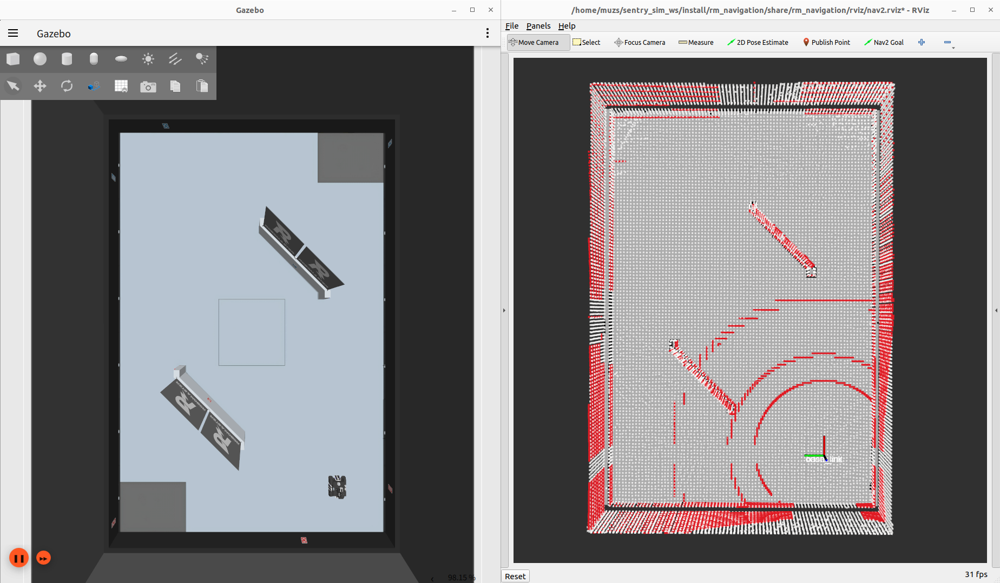
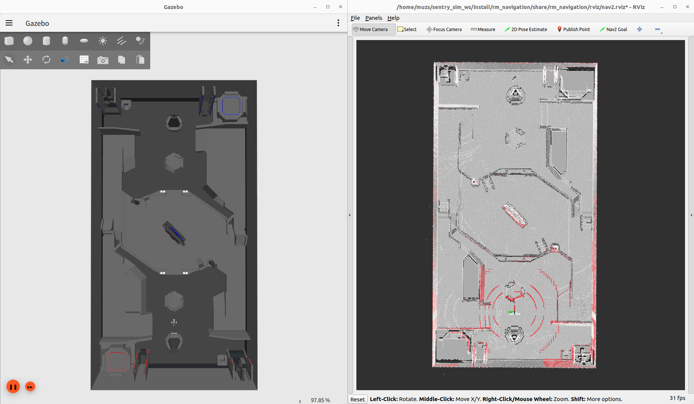

# TARS_Alignment

## 📢简介

这是一个点云配准功能包，用于获取机器人在已知环境中的初始位姿。

| RMUL | RMUC |
|:----:|:----:|
|||

### 话题

init_pose_alignment 节点：

| 话题名 | 类型 | 说明 | 订阅/发布 |
|:-----:|:---:|:----:|:-------:|
|`/livox/pointcloud`|`sensor_msgs/msg/PointCloud2`|用于匹配的源点云|订阅|
|`/initialpose`|`geometry_msgs/msg/PoseWithCovarianceStamped`|初始位姿猜测，可通过 RViz 发布|订阅|
|`/livox/map`|`sensor_msgs/msg/PointCloud2`|用于匹配的目标点云，来自 PCD 文件|发布|
|`/tf_map_to_odom`|`geometry_msgs::msg::TransformStamped`|匹配获得的变换结果|发布|

init_tf_publisher 节点：

| 话题名 | 类型 | 说明 | 订阅/发布 |
|:-----:|:---:|:----:|:-------:|
|`/tf_map_to_odom`|`geometry_msgs::msg::TransformStamped`|匹配获得的变换结果，用于发布静态TF变换|订阅|

### 目录结构

```
├── CMakeLists.txt
├── config
│   └── config.yaml  # 参数配置文件
├── init_pose_alignment
│   ├── init_pose_alignment.cpp  # 用于匹配获取变换结果
│   └── init_pose_alignment.hpp
├── init_tf_publisher
│   └── init_tf_publisher.cpp  # 用于发布静态TF变换
├── launch
│   └── alignment.launch.py
├── package.xml
└── utils
    └── command_launcher.hpp  # 用于在程序中启动其他 Launch 文件或脚本
```

## 🛠️前置要求

### 依赖

- [Ubuntu 22.04](https://releases.ubuntu.com/jammy/)
- [ROS2 Humble](https://docs.ros.org/en/humble/index.html)
- Eigen3
- PCL

### 构建

克隆该仓库并 colcon build：

```bash
cd ~/your_ws/src
git clone https://github.com/TARS-Go-Nav/tars_alignment.git

cd ~/your_ws
colcon build --symlink-install
```

## 🎮运行

### 食用指南

- 首先准备好点云地图（PCD 文件），建议提前预处理（降采样和去噪），以节省匹配时间。
- 在 `config.yaml` 中填写正确的 PCD 文件路径，并根据需要调整参数。
- 确保源点云正在被发布。
- 启动程序：

```bash
. install/setup.bash
ros2 launch alignment alignment.launch.py
```

### 算法主要流程

- 点云预处理
- 方向搜索，绕 Z 轴在 360 度范围内寻找匹配得分最佳的方向（默认每隔 20 度匹配一次）
- 多分辨率匹配（若不采用，则在初始猜测的基础上设置随机扰动进行多次匹配）
  - 第一阶段：NDT 匹配（默认 leaf_size 为 0.5）
  - 第二阶段（可选）：ICP 匹配（默认 leaf_size 为 0.25）
  - 第三阶段：GICP 匹配（默认 leaf_size 为 0.1）
- 比较各阶段匹配得分，发布得分最佳的匹配结果
- 匹配成功后，启动 LIO 进行后续定位（可选，在 `init_pose_alignment.cpp` 的 479-480 行）

## 👀关注我们

我们是吉林大学 TARS_Go 战队 AI 组。

|网站|[https://tars-cat.github.io](https://tars-cat.github.io/)|
|:-:|:-:|
|微信公众号|吉甲大师创新创业实践基地|
|哔哩哔哩|吉林大学TARS_Go战队|
|抖音|吉甲大师|
|小红书|吉林大学吉甲大师双创基地|
